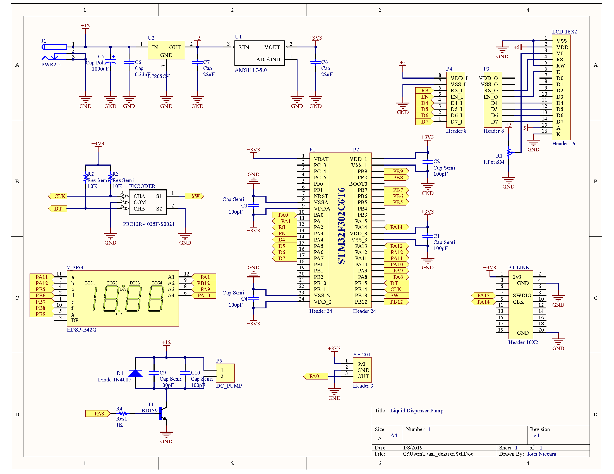

# DEMO:
https://youtu.be/8LGPzeiTgkU

# pompa-dozare-lichide
Prin realizarea proiectului se doreste realizarea unui dozator de lichide cu parametri reglabili, cu ajutorul unei pompe si a unui traductor de debit.

## Pompa DC sumersibila
**Specificatii**
<ul>
  <li>Tensiune de alimentare: 3V - 5V DC;</li>
  <li>Curent consumat: 100mA - 200mA;</li>
  <li>Adâncime recomandată: 0.3 - 0.8 metri;</li>
  <li>Debit: 1.2 - 1.6 L/minut;</li>
</ul>

Turatia pompei se va controla cu un semnal PWM.

## Debitmetru YF S401 0.3-6L/min
**Specificatii**
<ul>
  <li>Prindere furtun: 1/4"</li>
  <li>Temperatura de lucru : -25~+80 grade Celsius</li>
  <li>Presiune maxima: 1.75Mpa</li>
  <li>Tensiune de lucru: ≤ 5V DC 10 mA</li>
  <li>Dimensiuni: 5.8 cm x 3.5 cm x 2.7 cm</li>
</ul>

Informatiile despre debit sunt date de un semnal PWM cu factor de umplere 50% cu frecventa variabila.

## LCD 16x2
Afisarea informatiilor despre debit se vor afisa pe un LCD 16x2
 - update rev.1 afisarea alterativ pe 7-Segments Digits
## Encoder rotativ
Modificarea parametrilor se va face cu ajutorul unui encoder rotativ cu functie de SW.

Programul se va scrie in limbajul de programare C.
 - Mediu de dezvoltare utilizat: Atollic TRUE Studio
 - Microcontroller utilizat: STM32F302C6T6
 - programator-debugger utilizat: ST-LINK V.2
 

## Schema electronica:

